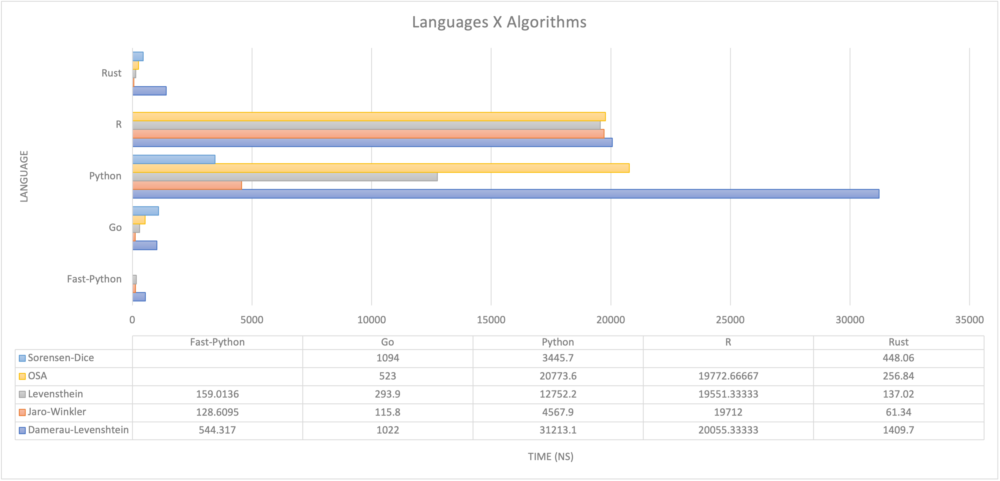

# Drug Extraction Performance Comparison

## Performance Analysis

This branch exists for performance analysis comparing Python, R, Python (w/ C libs), Golang, and Rust performance on string similarity metrics.

Each directory (`python-lang`, `go-lang`, `rust-lang`, `fast-python-lang` and `r-lang`) contains various benchmarks and tests for algorithms that overlapped in the three packages selected.

### Built With

- [docker](https://www.docker.com)
- [rust](https://www.rust-lang.org)
- [go](https://go.dev)
- [python](https://www.python.org)
- [R](https://www.r-project.org)
- [pytest](https://github.com/pytest-dev/pytest)
- [pytest-benchmark](https://github.com/ionelmc/pytest-benchmark/)
- [r benchmark](https://cran.r-project.org/web/packages/rbenchmark/rbenchmark.pdf)
- [criterion](https://github.com/bheisler/criterion.rs)
- [cargo-criterion](https://github.com/bheisler/cargo-criterion)
- [python-Levenshtein](https://github.com/ztane/python-Levenshtein/)
- [python-damerau-Levenshtein](https://github.com/robertgr991/fastDamerauLevenshtein)
- [python string-sim](https://github.com/luozhouyang/python-string-similarity)
- [r string dist](https://github.com/markvanderloo/stringdist)
- [go-edlib](https://github.com/hbollon/go-edlib)
- [rust string sim](https://github.com/dguo/strsim-rs)

## Getting Started

To get a local copy up and running follow these simple example steps.

### Prerequisites

This is an example of how to list things you need to use the software and how to install them.

- Docker >= 20.0
- [Git](https://git-scm.com) >= 2.35

### Installation

Download project using git:

`git clone -b perf-comp https://github.com/UK-IPOP/drug-extraction`

which gives you the performance comparison branch 😃

then simply `cd drug-extraction` to get into the active directory.

## Usage

In order to successfully run the benchmarks or tests you need to make the scripts you are going to run executable.  
This can be accomplished by simply running: `chmod u+x scripts` which will make all the files in the scripts directory executable.

Running the benchmarks is then simply: `./scripts/bench.sh`.

To run the benchmarks and log their output to a file: `./scripts/run-benchmarks.sh`.

The log file can be found at `data/results.log`. This script will also open up the interactive Rust report (from criterion) for you.

These scripts utilize docker images and containers to avoid having to install and manage all of these languages and dependencies on your system.

### Benchmarks

To actually run the benchmarks yourself first decide if you want the results logged to file or simply output to the terminal.
Then use the corresponding make command (either `bench` or `bench-save`).

The results from save runs (`<LANGUAGE-FOLDER>/logs/bench_results.log`) are appended each benchmarking run and are manually examined and entered into a [spreadsheet](data/bench_results.csv) for easy analysis and cross-language comparison.

> The time recorded is _averaged_ (~1,000,000 iterations) for each algorithm/comparison run.

For example: `make bench` (inside the python directory) to run all the benchmarks and print output (no save). This variation requires you to have all the dependencies for that language installed.

Alternatively, you can simply `docker build` and then `docker run` inside the language directory to run benchmarks for that language only. This requires you _only_ to have Docker installed.

#### Benchmark Results

## Contributing

Contributions are what make the open source community such an amazing place to learn, inspire, and create. Any contributions you make are **greatly appreciated**.

If you have a suggestion that would make this better, please fork the repo and create a pull request. You can also simply open an issue with the tag "enhancement".
Don't forget to give the project a star! Thanks again!

1. Fork the Project
2. Create your Feature Branch (`git checkout -b feature/AmazingFeature`)
3. Commit your Changes (`git commit -m 'Add some AmazingFeature'`)
4. Push to the Branch (`git push origin feature/AmazingFeature`)
5. Open a Pull Request

## License

Distributed under the MIT License. See `LICENSE.txt` for more information.

## Contact

Nick Anthony - [@nanthony95](https://twitter.com/Nanthony95) - nanthony@gmail.com

## Acknowledgments

- Chris Delcher - Twitter: [@chris_delcher](https://twitter.com/chris_delcher) - University [Profile](https://pharmacy.uky.edu/people/chris-delcher)
- Daniel Harris - University [Profile](https://pharmacy.uky.edu/people/daniel-harris)
- Michelle Duong - Twitter: [@mduong26](https://twitter.com/mduong26) - GitHub: [@mduong26](https://github.com/mduong26)
