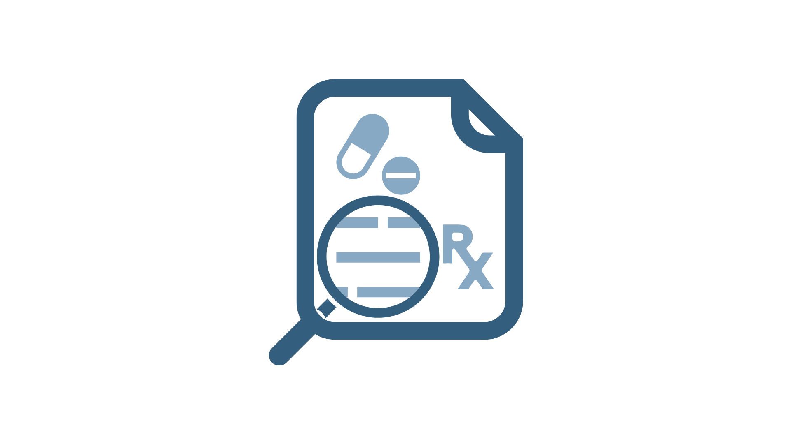

[![Stargazers][stars-shield]][stars-url]
[![Issues][issues-shield]][issues-url]
[![MIT License][license-shield]][license-url]

<!-- PROJECT LOGO -->
 ****

  

  <h3 align="center">Drug Extraction ToolBox</h3>

  

    A suite of tools to extract drugs from text records.
     
     
    <strong>Explore the docs >></strong>
    <a href="https://github.com/UK-IPOP/drug-extraction/tree/main/cli">CLI</a>
    |
    <a href="https://github.com/UK-IPOP/drug-extraction/tree/main/web">Web</a>
     
    <a href="https://github.com/UK-IPOP/drug-extraction/issues/new">Report Bug</a>
    |
    <a href="https://github.com/UK-IPOP/drug-extraction/issues/new">Request Feature</a>
  

[![WEBSITE][play-shield]][play-url]

This project uses string similarity metrics to detect drug mentions inside text records.

Researchers at the University of Kentucky College of Pharmacy had a need for a simple, fast, intuitive interface to extract drug mentions in text records. This project takes text records and detects drug mentions (including misspellings) and then extracts the drug and the corresponding record for analysis.

(<a href="#top">back to top</a>)

### Built With

- [Rust](https://www.rust-lang.org) 🦀
- [Maturin](https://www.maturin.rs) 🦀+🐍
- [Python](https://www.python.org) 🐍
- [Next.js](https://nextjs.org/) + [NextUI](https://nextui.org)

(<a href="#top">back to top</a>)

## Getting Started

In order to set clear expectations for the development of the toolbox and to keep feature requests in scope it is good to set some guidelines.

What this project IS:

- A suite of tools to extract drug mentions from text records
- A string parsing tool
- An interactive playground website

What this project is NOT:

- An analytical tool
- A business intelligence tool
- A preprocessing tool

This toolbox contains multiple projects:

- A command line tool (available via cargo install)
- An interactive website for exploring string similarity metrics

> **In v1.0.0 we have dropped support for both the `de-workflow` CLI and the `drug-extraction-core` library. Both are still available on PyPI.org and crates.io respectively but are not considered to be maintained.**
>
> For more information on the reasons for these significant changes, see the [CHANGELOG.md](CHANGELOG.md).

We utilize string similarity algorithms as defined and implemented by [Danny Guo](https://github.com/dguo) in the [str-sim](https://github.com/dguo/strsim-rs) package. For more information on string similarity algorithms, please consult [this](https://en.wikipedia.org/wiki/String_metric) Wikipedia page for a comparison/list of algorithms and [this](https://en.wikipedia.org/wiki/Edit_distance) page for an explanation of string metrics more generally.

The decision to use Rust was based on a series of performance comparison benchmarks and analysis which can be found on the `perf-comp` [branch](https://github.com/UK-IPOP/drug-extraction/tree/perf-comp) 📊.

Take a quick look 👀:

(<a href="#top">back to top</a>)

## RoadMap

As of `v1.0.0` we are considered stable and will prioritize not breaking features. Most new releases will come via performance improvements or new features (without breaking existing UI).

See the [open issues](https://github.com/UK-IPOP/drug-extraction/issues) for a full list of proposed features (and known issues).

(<a href="#top">back to top</a>)

## Contributing

Contributions are what make the open source community such an amazing place to learn, inspire, and create. Any contributions you make are **greatly appreciated**.

If you have a suggestion that would make this better, please fork the repo and create a pull request. You can also simply open an issue with the tag "enhancement".
Don't forget to give the project a star! Thanks again!

1. Fork the Project
2. Create your Feature Branch (`git checkout -b feature/AmazingFeature`)
3. Commit your Changes (`git commit -m 'Add some AmazingFeature'`)
4. Push to the Branch (`git push origin feature/AmazingFeature`)
5. Open a Pull Request

We use `gh release create` to make new github releases, `cargo release` to release to crates.io, and `maturin release` to release to PyPI.org.

(<a href="#top">back to top</a>)

## License

Distributed under the MIT License. See [LICENSE](LICENSE) for more information.

(<a href="#top">back to top</a>)

## Contact

Nick Anthony - [@nanthony95](https://twitter.com/nanthony95) - nicholas.anthony@uky.edu

Project Link: [https://github.com/uk-ipop/drug-extraction](https://github.com/uk-ipop/drug-extraction)

<!-- https://www.markdownguide.org/basic-syntax/#reference-style-links -->

[stars-shield]: https://img.shields.io/github/stars/uk-ipop/drug-extraction?style=for-the-badge
[stars-url]: https://github.com/uk-ipop/drug-extraction/stargazers
[issues-shield]: https://img.shields.io/github/issues/uk-ipop/drug-extraction?style=for-the-badge
[issues-url]: https://github.com/uk-ipop/drug-extraction/issues
[license-shield]: https://img.shields.io/github/license/uk-ipop/drug-extraction.svg?style=for-the-badge
[license-url]: https://github.com/uk-ipop/drug-extraction/blob/master/LICENSE.txt
[play-shield]: https://img.shields.io/badge/Website-blue?style=for-the-badge
[play-url]: https://github.com/UK-IPOP/drug-extraction
