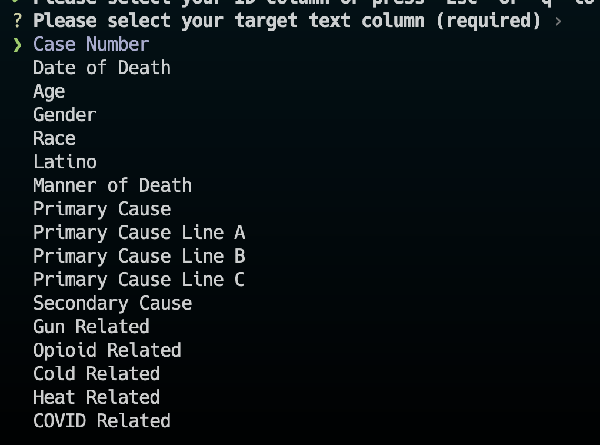
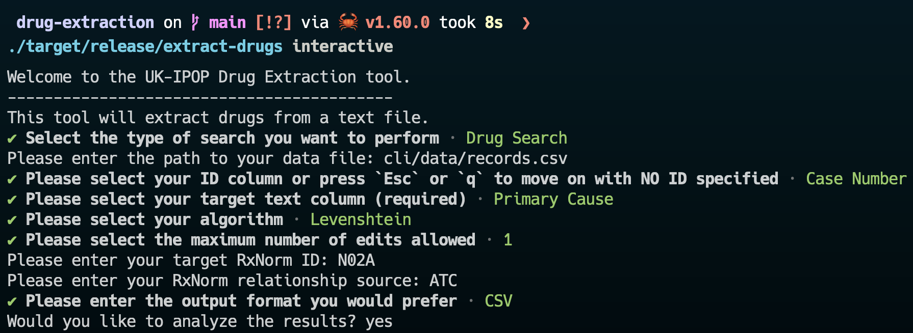
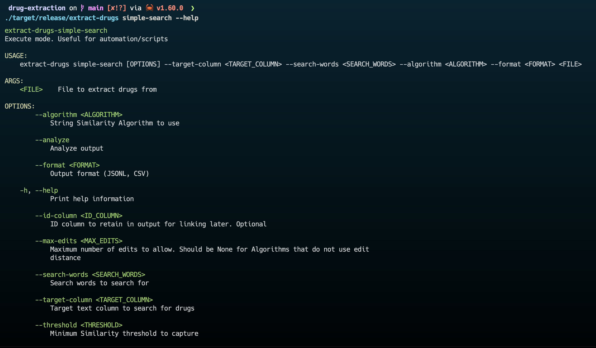
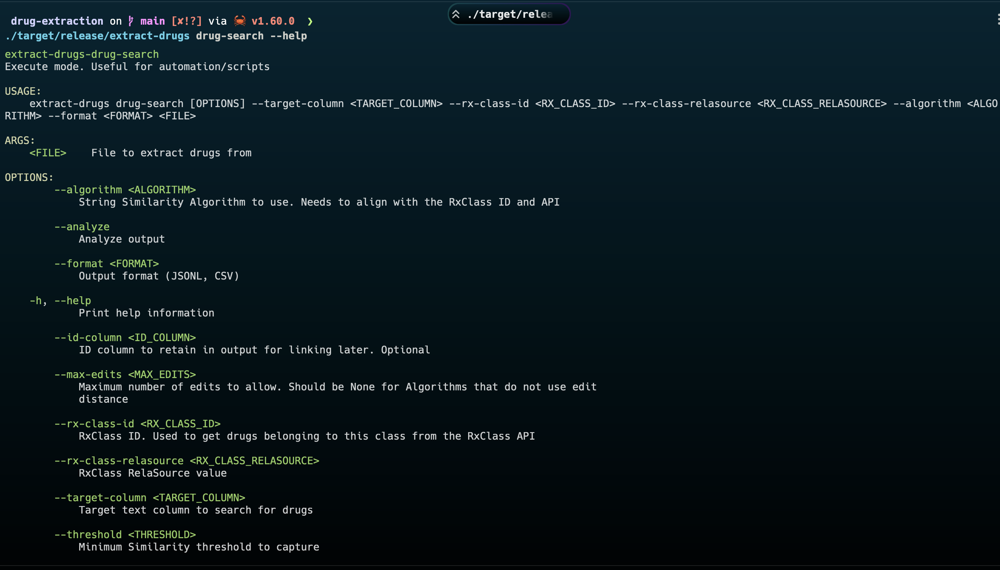
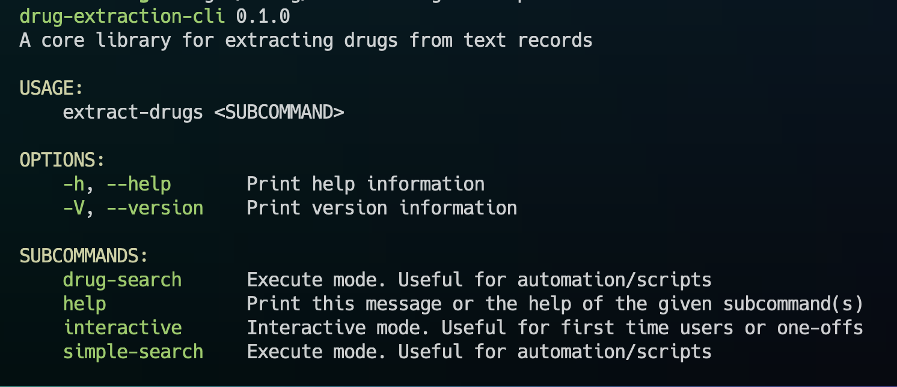
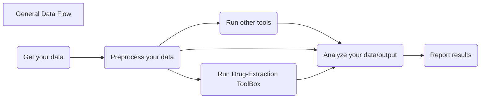

# Drug Extraction CLI

This is the CLI application that consumes the [Core](https://github.com/UK-IPOP/drug-extraction/tree/main/core) library.

Full API documentation can be found on [docs.rs](https://docs.rs/crate/drug-extraction-cli/latest).

- [Drug Extraction CLI](#drug-extraction-cli)
  - [Description](#description)
  - [Requires](#requires)
  - [Installation](#installation)
  - [Usage](#usage)
    - [Interactive](#interactive)
    - [Simple-Search](#simple-search)
    - [Drug-Search](#drug-search)
      - [RxClass/RxNorm Operations](#rxclassrxnorm-operations)
    - [Help](#help)
  - [Workflows](#workflows)
    - [Workflow Examples](#workflow-examples)
  - [Support](#support)
  - [Contributing](#contributing)
  - [MIT License](#mit-license)

## Description

This application takes a CSV file and parses text records to detect and extract drug mentions using string similarity algorithms to account for common misspellings.

In general, we expect users to know which string similarity algorithm they want and the limits on its interpretations. For more resources on string similarity algorithms see the main [ToolBox page](https://github.com/UK-IPOP/drug-extraction/). When in doubt, the defaults in the `interactive` command are quite reasonable.

If you are wondering about specific use cases, check out the [Workflows](#workflows) section below!

## Requires

- [cargo](https://doc.rust-lang.org/cargo/getting-started/installation.html) package manager (rust toolchain)
- [just](https://github.com/casey/just) (optional dev-dependency if you clone this repo)

## Installation

Cargo is available as a part of the Rust toolchain and is readily available via curl + sh combo (see [here](https://doc.rust-lang.org/cargo/getting-started/installation.html)).

To install the drug-extraction-cli application, simply:

```bash
cargo install drug-extraction-cli
```

This will install an executable called `extract-drugs`.

> \*IMPORTANT\*: The cli package is `drug-extraction-cli` but the binary program is renamed to `extract-drugs` for more intuitive commands.

## Usage

This application has three primary commands: `interactive`, `simple-search`, and `drug-search`. Both of the search commands share similar flags/options while the interactive command guides users through selecting options.

### Interactive

This will present you with a series of prompts to help you select correct options. Highly recommended for new users or one-off runs.

Usage:

```bash
extract-drugs interactive
```

This helps users select the correct options by, for example, only providing an edit distance limit when an edit-distance metric is selected.

There is also a series of nice select prompts to select the desired `id-column` and `target-column`:



It also provides options for the desired output format.

> The output file will always be named `extracted_drugs` and will be suffixed by either `.csv` or `.jsonl` depending on your selected format.

Example:


Output:


As you can see we even provide some useful comments on the data collected.

### Simple-Search

Simple Search works great if you have only a few drugs you are interested in and you want to search for them exclusively. As noted above, these search variants are better if you are more familiar with Linux/shell commands and more comfortable passing flags and/or using this for automation purposes or running on multiple files and combing results. For an example of the latter, see [Workflows](#Workflows)

> BONUS: You can use this to search for MORE than just drugs. For example, we frequently use it to search for COVID-19 (and variants), Narcan/Naloxone, and other key words in the healthcare industry.

You should pass in your search-words separated by a "|" symbol.

The usage here is a bit more complicated:

```bash
extract-drugs simple-search \
        cli/data/records.csv \
        --algorithm "l" \
        --max-edits 1 \
        --id-column "Case Number" \
        --target-column "Primary Cause" \
        --search-words "coacine|heroin|Fentanil" \
        --format csv \
        --analyze
```

_Remember, you can always use `--help` after any command to get help and more information._

Help:


### Drug-Search

For more direct access to drugs of interest, we provide interactivity with the popular RxNorm resource. We utilize [RxClass](https://mor.nlm.nih.gov/RxClass/) in order to get a **group** of drugs as opposed to a single/few drugs (for which `simple-search` should be used).

We specifically use [this](https://lhncbc.nlm.nih.gov/RxNav/APIs/api-RxClass.getClassMembers.html) request, so if you need to know _exactly_ what we are looking for you will find it there in the RxClass documentation.

#### RxClass/RxNorm Operations

This command requires knowledge of two(2) key data points regarding your target RxClass:

1. The RxClass ID
2. The RxClass RelaSource

We can find these by using the NIH/NLM's RxNav [explorer](https://mor.nlm.nih.gov/RxNav/). This page contains all of the information that we will need. Below is a screenshot demonstrating usage of the navigator to find the correct parameters to pass to this drug-extraction tool.


A full list of RelaSources can be found [here](https://lhncbc.nlm.nih.gov/RxNav/APIs/api-RxClass.getClassMembers.html) although I recommended just sticking to either `ATC` or `MESH` and then using the RxNav explorer to find the target Class ID.

The usage here is very similar to `simple-search` but replacing `search-words` with RxClass information.

```bash
extract-drugs drug-search cli/data/records.csv \
    --algorithm "d" \
    --max-edits 2 \
    --target-column "Primary Cause" \
    --rx-class-id N02A \
    --rx-class-relasource ATC \
    --format jsonl \
    --analyze
```

_Remember, you can always use `--help` after any command to get help and more information._

Help:


### Help

To get more help use the CLI:

```bash
extract-drugs --help
```



## Workflows

We see two primary workflows for this tool. I do not considering one-offs as need a repeated "workflow" and that is why they are suggested to use the `interactive` command 😃.

However, sometimes we want more. Maybe we want to run the tool using `drug-search` on an RxClass and then run it again using `simple-search` and combine the results. Or maybe we want to run the exact same command twice just switching the `--target-column` to another text field.

A (very) general workflow:



We provide some convenience scripts on the main Toolbox page for a few key workflows we see. These are written in different languages (Python) but don't have any other dependencies besides the languages themselves and thus should run smoothly. Note that the tools is _invoked from_ Python via the `subprocess` module and the data is then manipulated inside Python. Python was chosen due to my personal profeciency with it and its commonality as a data science tool.

### Workflow Examples

1. [Convert CSV output to wide-form (flag-oriented)](../scripts/wide-form-csv.py)
   1. This is useful for researchers/analysts who want to see record-level results of the tool.
   2. This requires that you provided an `--id-column` to the tool.
   3. This example uses `simple-search` so be sure to adapt it to `drug-search` by switching both the command options and the column you access in the csv file
   4. After this you can join both files on the ID columns using an analytic tool like [pandas](https://pandas.pydata.org)
2. [Running on multiple columns and combining results](../scripts/multiple-columns.py)
3. [Running `drug-search` then `simple-search` and combining results](../scripts/drugs-then-simple.py)

## Support

If you encounter any issues or need support please either contact [@nanthony007](<[github.com/](https://github.com/nanthony007)>) or [open an issue](https://github.com/UK-IPOP/drug-extraction/issues/new).

## Contributing

Contributions are what make the open source community such an amazing place to learn, inspire, and create. Any contributions you make are **greatly appreciated**.

If you have a suggestion that would make this better, please fork the repo and create a pull request. You can also simply open an issue with the tag "enhancement".
Don't forget to give the project a star! Thanks again!

1. Fork the Project
2. Create your Feature Branch (`git checkout -b feature/AmazingFeature`)
3. Commit your Changes (`git commit -m 'Add some AmazingFeature'`)
4. Push to the Branch (`git push origin feature/AmazingFeature`)
5. Open a Pull Request

See [CONTRIBUTING.md](CONTRIBUTING.md) for more details.

## MIT License

[LICENSE](LICENSE)
