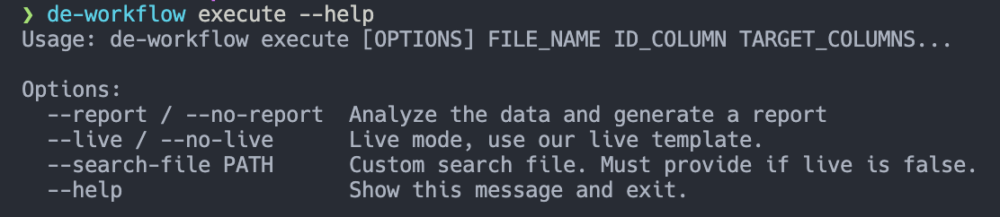
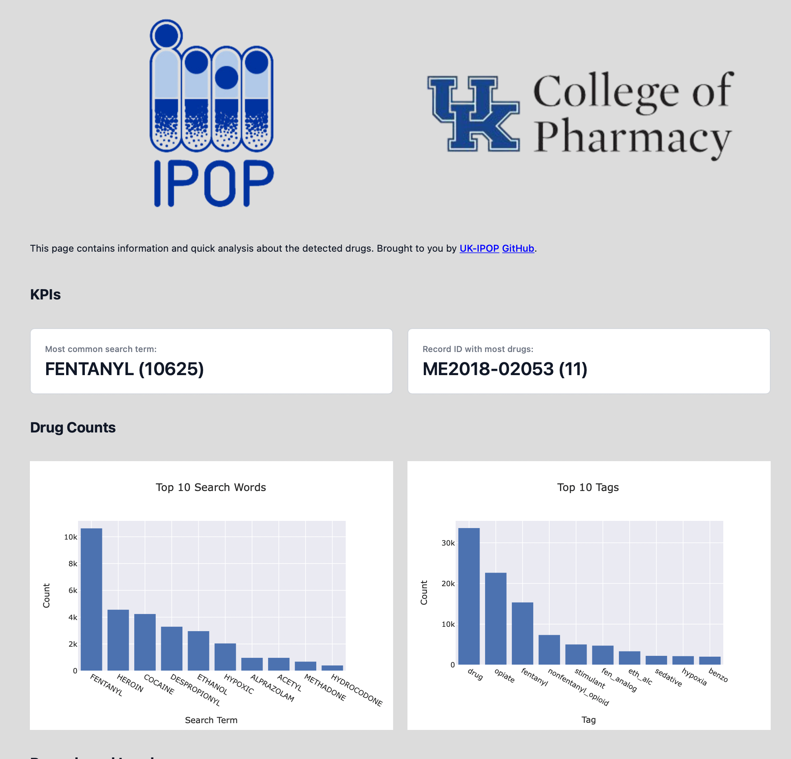
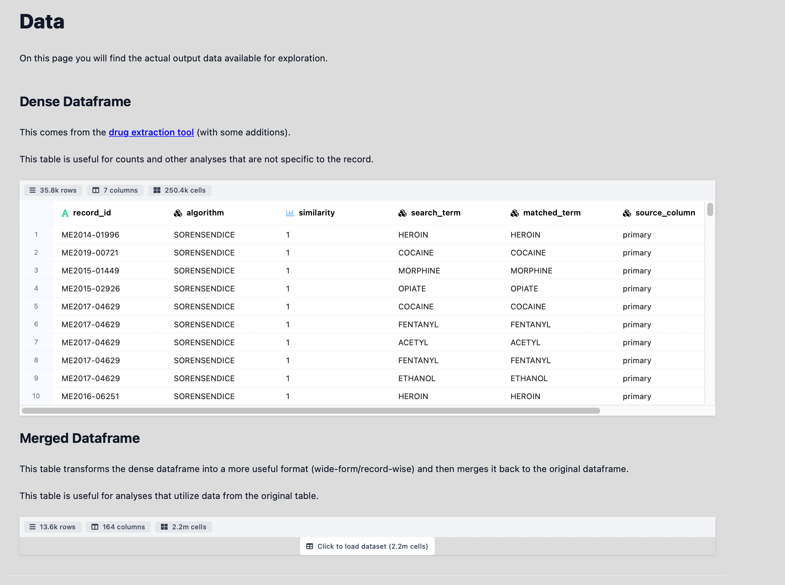

# DE Workflow

This is a small wrapper program around the [drug-extraction-cli](https://github.com/UK-IPOP/drug-extraction/tree/main/cli) program.

It is effectively a convenience wrapper for us and our typical use-case.

Benefits over the standard CLI:

- Multi-column support (it _expects_ two columns -- a primary and a secondary)
- Wide form data created automatically
- Wide form data attached to source data ready for analysis
- Automated report generation
- Use of either our/your custom search template _with tags!_

It can generate a nice report using [datapane](https://github.com/datapane/datapane) for some quick eye-ball analysis.

It uses `data/drug_info.json` ([link](data/drug_info.json)) as our template for custom search words **with tags**. This can be extended or edited where you can provide ANY custom search file you want as long as it matches our format. Alternatively you can enable `--live` mode and just use ours 🙂.

- [DE Workflow](#de-workflow)
  - [Requirements](#requirements)
  - [Installation](#installation)
  - [Usage](#usage)
  - [Sample Output](#sample-output)
  - [Support](#support)
  - [Contributing](#contributing)
  - [MIT License](#mit-license)

## Requirements

- [pipx](https://pypa.github.io/pipx/)
- [drug-extraction-cli program](../cli/README.md)

## Installation

You can install this program with [pipx](https://pypa.github.io/pipx/):

```bash
pipx install de-workflow
```

You can then easily get help for the only command (execute) like so:

```bash
de-workflow execute --help
```

Which should look something like this:


## Usage

To run this tool all you will need to know is:

- The name of your file
- Your ID column for linking
- Your Target column(s) to search in

You can then run the tool:

```bash
de-workflow execute ../cli/data/records.csv "Case Number" "Primary Cause" "Secondary Cause"
```

This will run the underlying drug extraction program so you **MUST** have the main [CLI](https://github.com/UK-IPOP/drug-extraction/tree/main/cli) tool installed.

There are additional flags for reporting and custom file searching.

`--report/--no-report` identifies whether or not to produce a `datapane` report at the end. Suggested and default value is `--report`.

`--live/no-live` identifies whether or not you want you use our [template](data/drug_info.json).

If you do **NOT** want to use our template, you can disable live (`--no-live`) but you then MUST provide a custom `--search-file` for the program to use. This file should be in `json` format and match the structure of our template so that the tool can work correctly.

## Sample Output





## Support

If you encounter any issues or need support please either contact [@nanthony007](<[github.com/](https://github.com/nanthony007)>) or [open an issue](https://github.com/UK-IPOP/drug-extraction/issues/new).

## Contributing

Contributions are what make the open source community such an amazing place to learn, inspire, and create. Any contributions you make are **greatly appreciated**.

If you have a suggestion that would make this better, please fork the repo and create a pull request. You can also simply open an issue with the tag "enhancement".
Don't forget to give the project a star! Thanks again!

1. Fork the Project
2. Create your Feature Branch (`git checkout -b feature/AmazingFeature`)
3. Commit your Changes (`git commit -m 'Add some AmazingFeature'`)
4. Push to the Branch (`git push origin feature/AmazingFeature`)
5. Open a Pull Request

See [CONTRIBUTING.md](CONTRIBUTING.md) for more details.

## MIT License

[LICENSE](LICENSE)
