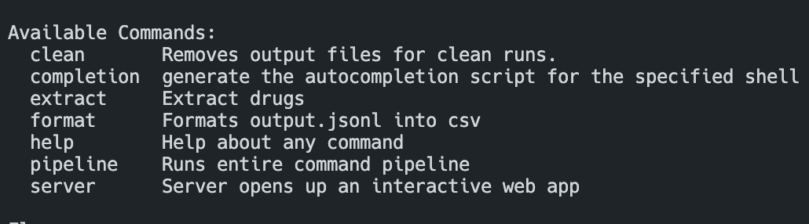
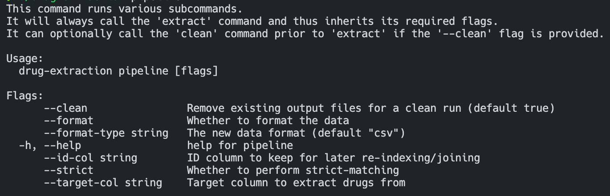

---
hide:
  - navigation
---

# CLI API

The command line interface is more robust than the web-server. This interface can run without
a graphical display and has no timeout issues and thus makes it ideal for usage on remote servers
where it can work on larger datasets over longer time-periods.

## Commands

The list of available commands are:

- extract
- clean
- format
- pipeline
- server

You can view this list in your terminal by running:

```bash
drug-extraction -h
```

and you should see brief descriptions on each command:


Each command can be further inspected by running `drug-extraction <COMMAND> -h`.
For example:

```bash
drug-extraction pipeline -h
```

which would output:



The command documentation available in this manner will _always_ be up to date, even when this
documentation site may be behind.

### Extract

Extracts drugs from the specified file (which is the first and only parameter after the command). Data is expected in `.csv` format and data is extracted from the specified `--target-col`. The specified `--id-col` is maintained for later re-joins to the original data.

### Clean

Removes output files for clean runs. Current output files:

- output.jsonl
- output.json
- output.csv

### Format

Transforms the existing `output.jsonl` data to a new file type, either json or csv for usage in other software (i.e. spreadsheets).

### Pipeline

Pipeline runs some or all of the above commands based on which flags are specified, but will always run the `extract` command.

For more information on available flags, type `drug-extraction pipeline -h` into your prompt.

### Server

This command starts the server GUI and is the default root command.

## Flags

The list of available flags are:

- clean
- format
- format-type
- strict
- id-col
- target-col

Some flags only correspond to certain commands and thus are not globally available.
For more information run `drug-extraction <command-of-interest> -h`

### --clean

A boolean flag for whether or not to remove existing output data files before running.

### --format

Boolean flag as to whether or not to format the data.

### --format-type

If formatting, the format type to translate to, either csv or json.

### --strict

Whether to perform matching of only exact matches (similarity=1.0).

### --id-col

The id column in the input file to maintain.

### --target-col

The target text column in the input file to extract drugs from.
