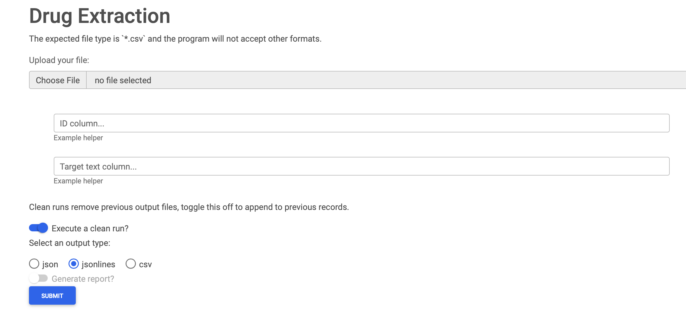

---
hide:
  - navigation
---

# Server Usage

When you install the package you have the ability to run
he program directly from your downloads folder.

You can do this by extracting the `.tar.gz` file and
opening the resulting folder where you should find the executable file named
`drug-extraction`.

If you double click on this file it will ask for permissions to your computer
(please grant) and then will open your default web browser to a web interface for
you to interact with the program. This default execution behavior of running a web-based GUI
(graphical user interface) was chosen to reduce technical knowledge required to use this tool.

## Example Web Interface

> This interface is constantly changing as we look to stabilize the API and thus may not directly resemble
> this image.

## Usage

Using the server is as simple as using any website you may visit. However, there are currently a few
specifications that may help ease the process.

### Important Security Notes

It is import to note that this server is running _locally_ on _your_ machine and thus, if your machine
meets the data security standards for your project, then this interface is acceptable to use,
just like the command line version. **All processing is done on the host device.**

### Server Fields MetaData

Some of the fields are rather particular and while work is being done to add helpful tooltips and text to
the server itself, this section of documentation can aide troubles. These fields closely (in some cases directly)
relate to CLI flags or commands.

|  Field Name   |                                     Description                                      |         Limits         |
| :-----------: | :----------------------------------------------------------------------------------: | :--------------------: |
|  File Upload  |                        The file you wish to run this tool on                         | Must be a `*.csv` file |
|   ID Column   |            ID column to keep for later analysis/joining to original data             |        Spelling        |
| Target Column |                      Text column to run the extraction tool on                       |        Spelling        |
|   Clean Run   | Whether to delete previously exported data. Default=True. Disable to append records. |          None          |
|  Strict Run   |                 Whether to only return exact matches. Default=False.                 |          None          |
|  Output Type  |    Whether to generate a specific output. Default=jsonlines. Can be csv or json.     |          None          |
|    Report     |          Whether to generate a brief statistical report of the output data.          |     In progress...     |

## Known Issues

You can rerun the server with many different configurations without restarting it completely. _However_,
if your _source_ data file changes, you may need to restart the server/program for the changes to be available.
This is due to the server caching mechanism which stores cashes previously uploaded files for you (as a performance enhancement).
Do not worry, these caches files are still on your local file system.
