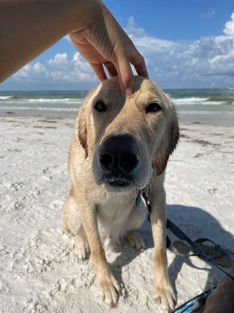
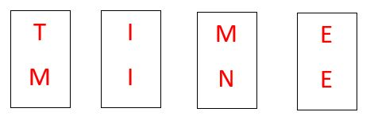
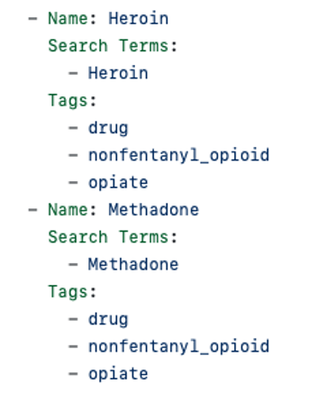
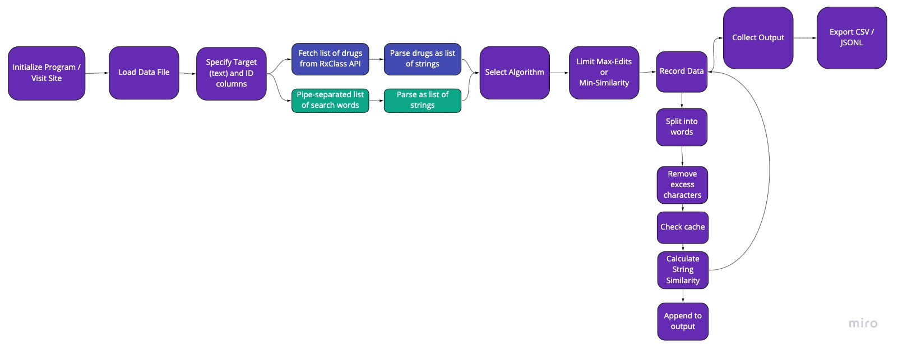
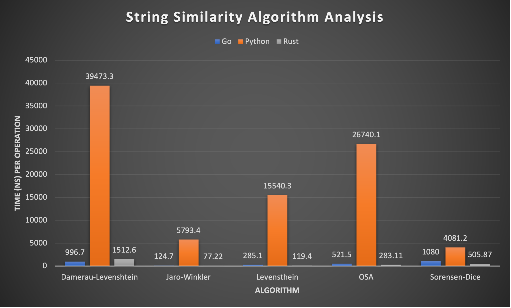
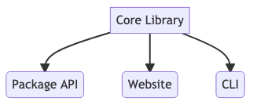
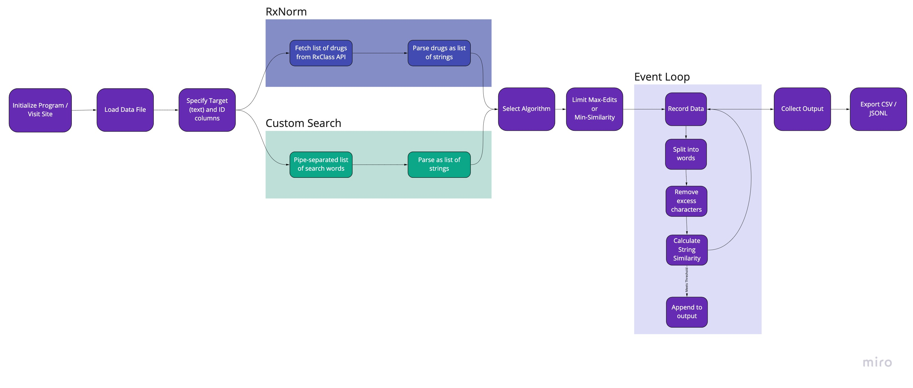

<!-- TODO: cite images when using for larger audience -->

# Drug Extraction ToolBox

Nick Anthony
Data Engineer - University of Kentucky - College of Pharmacy

GitHub: @nanthony007 / @UK-IPOP
Twitter: @nanthony95
Email: nicholas.anthony@uky.edu

---

## A little about me

- I build data-driven OSS software
- Started in analytics
- Dabble in web development
- Appreciate speed and simplicity
- Love my doggo

---

<!-- _class: lead -->

## Let's Talk Drugs

<!-- Like I said I work at COP so most of the projects I work on are related
in some way/shape/form to pharmaceuticals, the opioid epidemic, or medical
health records data.  -->

---

## Problem Exploration

- Chicago Medical Examiner’s Case Archive
  - Open Data provided by Cook County
  - Contains lots of useful death information for pharmaceutical and public health researchers
  - Primary Cause of Death
    - Ex 1: “NOVEL CORONA (COVID-19) VIRAL INFECTION”
    - Ex 2: “COMBINED DRUG (COCAINE, FENTANYL, HEROIN, CLONAZEPAM)"

<!-- Researchers want to know a unique list of drugs to monitor opioid crisis
Researcher has specific drug list of interest
What do we do? -->

---

## First Attempts

1. String Matching using _grep_ in R
2. _Exact_ string matching using Python
3. String similarity searching using Python

<!--
These had numerous problems.

- # 1
  - Not portable
  - Introduce misspellings manually
  - Error prone
  - Slow, slow, slow
- # 2
  - A little faster
  - More tedious development
  - Implemented `Drug Search` File

Around this time we were building the regex model using JaroWinkler string similarity calculation.
For those of you who don’t know, SS is how close one string is to another, usually measured in a ratio of 0-1, 1 being a perfect match.

- # 3
  - HOURS to search

-->

---

## Golang to the rescue

- Go Benefits:

  - Compiled
  - Typed
  - Concurrency (goroutines)
  - Performance

- Idea!
  - Go CLI
  - "Web" frontend interface
  - Improve Drug Search file

<!--
Go provided improved performance from ~2 hours down to a few minutes.

Drug Info file expanded to include tags.

-->

---

## Drug Extraction Tool

- Cobra CLI
- Server command for web UI as default
- Available by click to install and run
- Cross platform (thank you goreleaser)
- STILL available via `go-tool` branch

<!--
NOTES
-->

---

<!-- _class: lead -->

## But can we do better?

<!--
Well sure…

It could always be faster…
What if we didn’t use a custom file for one researcher’s needs but made a flexible search system to serve many researchers
	-> That is going to need a nice UI
	-> Install process was easy but not straightforward, usage involved running a weird looking exe app…
	-> Better output
	-> PHI compliance

What about searching beyond uni-grams?

-->

---

## R & D

---

## Benchmark Testing

Would the benefits of another language system outweigh the costs of development and maintenance?

- Options:

  - Python
  - Go
  - Rust

<!--
Available on `perf-comp` branch on github.

Rules:
	External dependencies allowed, we don’t care about artifact size.
	Fast, but reasonable development time.
	Same implementation, different language.
	No “speed” libraries (i.e. python libraries relying on C)
	MUST use external libs for algorithm implementation
	Must be compared using same drug list.
	Must use same search list (~60k records from Chicago ME)
  Utilize docker for all runs

Interfaces:
  Web
  CLI
  Package
-->

---

## Standard Testing Program Flow

<!--
Drug search terms come from an rx-class-id
Custom search terms is '|'-separated word list

Scan target column using specified algorithm and filter for matches based on threshold/limits

Output matched word, source word, algorithm used, similarity, distance (if appropriate)
-->

---

<!--
Python
~150 lines
Go
~270 lines
Rust
~260 lines

~145 million iterations on only ~55k records with SHORT
text records

A few notes here:
Python is slow
Rust fastest

This matches what we know regarding performance

-->

---

<!-- _class: lead -->

# So Rust, right?

<!--

Revisiting problem definition made it not quite so easy... -->

---

## ToolBox Ecosystem

<!--

IDEAL: Web App enabled via Web Assembly (wasm) = native rust performance in the browser

Cargo crate for CLI (cargo install)
Core crate library for devs will be the standard program from testing
-->

---

<!-- Rust
NextJS
WebAssembly
-->

---

## Building the new tool

- Key Features:
  - Improved output (\*.csv)
  - Link to RxNorm in customizable way
  - Links to RXCUI, record ID
  - Custom search option (ignores RxNorm)
  - CLI tool is HIPPA compliant
  - Website is great for getting started
  - [DE-Workflow](https://github.com/UK-IPOP/drug-extraction/tree/main/de-workflow) shows what's possible

<!--
Improved on features needed from previous go tool.

Extend the base tool as needed for our use case.

RxNorm great for some use cases, but opioid research involves illicit substances so we also needed custom search, hence de-workflow.
-->

---

<!-- _class: lead -->

---

<!-- _class: lead -->

# Live Demo

---

## Acknowledgements

- Google
- Rust maintainers
- Chris Delcher
- Daniel Harris
- My wife

<!--
Google for their search engine. (stack overflow)

Rust maintainers for their amazing language and documentation.

Chris for having a need for such a useful tool. (if I ever make anything cool that you use or like, it’s probably because he needed it for something)

Daniel for providing technical guidance and wisdom.

My wife for patience when I’m smashing my head against the Rust compiler.
-->

---

## Resources

- [Code Repo](https://github.com/UK-IPOP/drug-extraction)
- [Rust Book](https://doc.rust-lang.org/book/)
- [NextJS](https://nextjs.org)
- [Miro](https://miro.com/app/)

---

<!-- _class: lead -->

# Questions?
