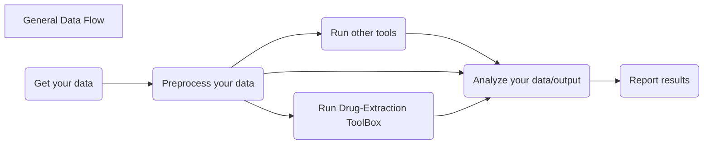

# Drug Extraction CLI

This is the CLI application that consumes the [Core](https://github.com/UK-IPOP/drug-extraction/tree/main/core) library.

Full API documentation can be found on [docs.rs](https://docs.rs/crate/drug-extraction-cli/latest).


- [Drug Extraction CLI](#drug-extraction-cli)
  - [Description](#description)
  - [Comparison with the CLI Tool](#comparison-with-the-cli-tool)
    - [Feature Comparison](#feature-comparison)
    - [Simple-Search](#simple-search)
    - [Drug-Search](#drug-search)
      - [RxClass/RxNorm Operations](#rxclassrxnorm-operations)
  - [Workflows](#workflows)
    - [Workflow Examples](#workflow-examples)
  - [Support](#support)
  - [Developer Install](#developer-install)
    - [Getting Started](#getting-started)
  - [Learn More](#learn-more)
  - [Contributing](#contributing)
  - [MIT License](#mit-license)

## Description

This application takes a CSV file and parses text records to detect and extract drug mentions using the [Levensthein Distance](https://en.wikipedia.org/wiki/Levenshtein_distance) Algorithm to account for common misspellings.

If you are wondering about specific use cases, check out the [Workflows](#workflows) section below!

## Comparison with the CLI Tool

Currently the website functions as a thin convinience wrapper around some general tooling.

In comparison with the [CLI Tool](https://github.com/UK-IPOP/drug-extraction/tree/main/cli) this website:

1. Has a smaller feature set
2. Is not HIPPA compliant
3. Not as performant
4. Not as practical for large datasets

These limitations are due _almost exclusively_ to time constraints on my part and can be solved by the following:

1. WASM Integration from [Core](https://github.com/UK-IPOP/drug-extraction/tree/main/core) Library
2. This one is trickier but could be solved by running this website locally. See [Developer Install](#developer-install).
3. WASM Integration
4. WASM Integration

As you can see, WASM bindings and their integration would be of great help! If you like the site I encourage you to contribute 🙂.

The feature disparity could also be resolved by WASM integration.

### Feature Comparison

|                               Feature                               |    CLI    | Website |
| :-----------------------------------------------------------------: | :-------: | :-----: |
|                         Multiple Algorithms                         |  ✅ (x5)  |   ❌    |
|                             Output Type                             | CSV/JSONL |   CSV   |
|                      Dynamic Column Selection                       |    ✅     |   ✅    |
|                        Simple Custom Search                         |    ✅     |   ✅    |
|                        Drug (Rx❌rm) Search                         |    ✅     |   ✅    |
|                       Limit Results on Edits                        |    ✅     |   ✅    |
|                     Limit Results on Similarity                     |    ✅     |   ✅    |
|                      Simple Analytical Output                       |    ✅     |   ❌    |
| [Concurrency](https://github.com/UK-IPOP/drug-extraction/issues/19) |    ❌     |   ❌    |

### Simple-Search

Simple Search works great if you have only a few drugs you are interested in and you want to search for them exclusively. As noted above, these search variants are better if you are more familiar with Linux/shell commands and more comfortable passing flags and/or using this for automation purposes or running on multiple files and combing results. For an example of the latter, see [Workflows](#Workflows)

> BONUS: You can use this to search for MORE than just drugs. For example, we frequently use it to search for COVID-19 (and variants), Narcan/Naloxone, and other key words in the healthcare industry.

You should pass in your search-words separated by a "|" symbol.

### Drug-Search

For more direct access to drugs of interest, we provide interactivity with the popular RxNorm resource. We utilize [RxClass](https://mor.nlm.nih.gov/RxClass/) in order to get a **group** of drugs as opposed to a single/few drugs (for which `simple-search` should be used).

We specifically use [this](https://lhncbc.nlm.nih.gov/RxNav/APIs/api-RxClass.getClassMembers.html) request, so if you need to know _exactly_ what we are looking for you will find it there in the RxClass documentation.

#### RxClass/RxNorm Operations

This command requires knowledge of two(2) key data points regarding your target RxClass:

1. The RxClass ID
2. The RxClass RelaSource

We can find these by using the NIH/NLM's RxNav [explorer](https://mor.nlm.nih.gov/RxNav/). This page contains all of the information that we will need. Below is a screenshot demonstrating usage of the navigator to find the correct parameters to pass to this drug-extraction tool.


A full list of RelaSources can be found [here](https://lhncbc.nlm.nih.gov/RxNav/APIs/api-RxClass.getClassMembers.html) although I recommended just sticking to either `ATC` or `MESH` and then using the RxNav explorer to find the target Class ID.

## Workflows

We see two primary workflows for this tool. I do not considering one-offs as need a repeated "workflow" and that is why they are suggested to use the `interactive` command 😃.

However, sometimes we want more. Maybe we want to run the tool using `drug-search` on an RxClass and then run it again using `simple-search` and combine the results. Or maybe we want to run the exact same command twice just switching the `--target-column` to another text field.

A (very) general workflow:



We provide some convenience scripts on the main Toolbox page for a few key workflows we see. These are written in different languages (Python) but don't have any other dependencies besides the languages themselves and thus should run smoothly. Note that the tools is _invoked from_ Python via the `subprocess` module and the data is then manipulated inside Python. Python was chosen due to my personal profeciency with it and its commonality as a data science tool.

### Workflow Examples

1. [Convert CSV output to wide-form (flag-oriented)](../scripts/wide-form-csv.py)
   1. This is useful for researchers/analysts who want to see record-level results of the tool.
   2. This requires that you provided an `--id-column` to the tool.
   3. This example uses `simple-search` so be sure to adapt it to `drug-search` by switching both the command options and the column you access in the csv file
   4. After this you can join both files on the ID columns using an analytic tool like [pandas](https://pandas.pydata.org)
2. [Running on multiple columns and combining results](../scripts/multiple-columns.py)
3. [Running `drug-search` then `simple-search` and combining results](../scripts/drugs-then-simple.py)

## Support

If you encounter any issues or need support please either contact [@nanthony007](<[github.com/](https://github.com/nanthony007)>) or [open an issue](https://github.com/UK-IPOP/drug-extraction/issues/new).

## Developer Install

This is a [Next.js](https://nextjs.org/) project bootstrapped with [`create-next-app`](https://github.com/vercel/next.js/tree/canary/packages/create-next-app).

### Getting Started

First clone the repo:

with GitHub CLI:

```bash
gh repo clone https://github.com/UK-IPOP/drug-extraction.git
```

or via HTTPS:

```bash
git clone https://github.com/UK-IPOP/drug-extraction.git
```

Run the development server:

```bash
npm run dev
# or
yarn dev
```

Open [http://localhost:3000](http://localhost:3000) with your browser to see the result.

You can start editing the page by modifying `pages/index.tsx`. The page auto-updates as you edit the file.

[API routes](https://nextjs.org/docs/api-routes/introduction) can be accessed on [http://localhost:3000/api/hello](http://localhost:3000/api/hello). This endpoint can be edited in `pages/api/hello.ts`.

The `pages/api` directory is mapped to `/api/*`. Files in this directory are treated as [API routes](https://nextjs.org/docs/api-routes/introduction) instead of React pages.

## Learn More

To learn more about Next.js, take a look at the following resources:

- [Next.js Documentation](https://nextjs.org/docs) - learn about Next.js features and API.
- [Learn Next.js](https://nextjs.org/learn) - an interactive Next.js tutorial.

You can check out [the Next.js GitHub repository](https://github.com/vercel/next.js/) - your feedback and contributions are welcome!

## Contributing

Contributions are what make the open source community such an amazing place to learn, inspire, and create. Any contributions you make are **greatly appreciated**.

If you have a suggestion that would make this better, please fork the repo and create a pull request. You can also simply open an issue with the tag "enhancement".
Don't forget to give the project a star! Thanks again!

1. Fork the Project
2. Create your Feature Branch (`git checkout -b feature/AmazingFeature`)
3. Commit your Changes (`git commit -m 'Add some AmazingFeature'`)
4. Push to the Branch (`git push origin feature/AmazingFeature`)
5. Open a Pull Request

See [CONTRIBUTING.md](CONTRIBUTING.md) for more details.

## MIT License

[LICENSE](LICENSE)
